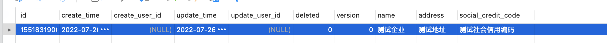
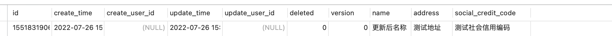
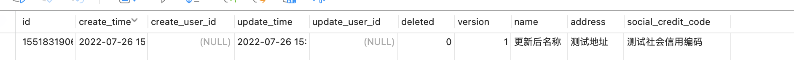
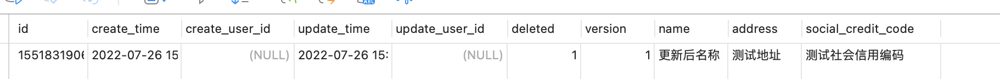
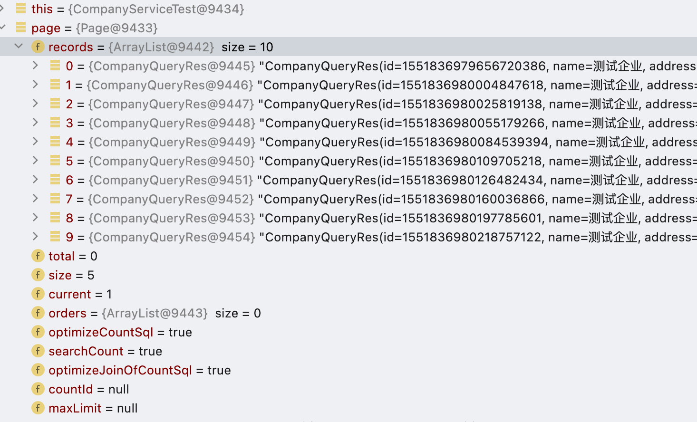
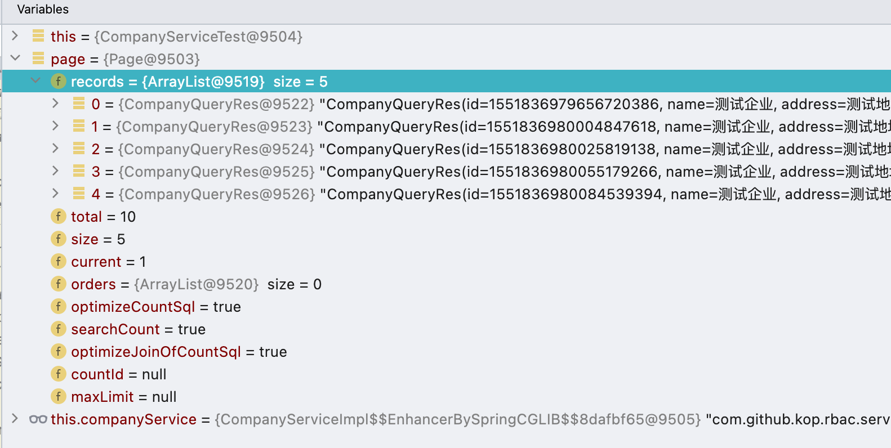

# 企业管理模块

本章将对企业管理模块中所涉及的接口进行开发讲解。

**注意: 由于本项目是一个学习性质的项目对于数据字段一定会出现不符合企业需求的情况，如有需要请自行修改**

## 需求分析

对于企业管理模块而言所需要的接口包含新增，修改，删除，查询。接下来对需求进行详细说明。
1. 新增需要记录创建人，创建时间、企业名称，企业地址，企业社会信用编码数据，其中企业名称为必填项。
2. 修改需要记录修改人、修改时间、企业名称，企业地址，企业社会信用编码数据，其中企业名称为必填项。
3. 删除根据id进行删除。
4. 根据id查看详情。
5. 查询需要提供列表查询和分页查询，分页查询将企业名称、企业地址、企业社会信用编码作为查询条件。


## 需求开发
根据需求分析可以明确需要制作如下接口。

| 接口地址               | 请求方式 | 接口说明       |
| ---------------------- | -------- | -------------- |
| /company/              | Post     | 创建企业       |
| /company/{id}          | Put      | 修改企业       |
| /company/{id}          | Get      | 根据id查看详情 |
| /company/{id}          | Delete   | 根据id删除     |
| /company/{page}/{size} | Get      | 分页           |
| /company/list          | Get      | 根据列表查询   |


### 验证接口设计
在创建数据、更新数据时不免需要对传入的参数进行数据有效性验证，这些数据的验证一般情况下可以通过hibernate-validate提供的注解进行验证，但是在实际开发过程中这些注解是不太能够完整覆盖项目需求的，因此需要对数据验证接口做相关设计。首先需要创建一个标记类型的接口`com.github.kop.rbac.utils.Validate`，该接口的定义是标记，因此不需要在该接口中编写相关方法。其次在Validate接口的同层包结构下创建CreateValidate接口和UpdateValidate接口，前者接口用于在创建时进行验证使用，后者接口用于在更新时使用，三个接口的具体代码如下。

```java
public interface Validate {
}
public interface CreateValidate<C> extends Validate {
    void createValidate(C c) throws ValidateException;
}
public interface UpdateValidate<U> extends Validate {
    void updateValidate(U u) throws ValidateException;
}
```

在上述代码中还需要使用到一个验证异常ValidateException，该类直接继承NoceException类编写相关构造函数即可。

### 接口开发

本节将对企业管理模块的相关接口进行开发说明。首先需要在api包下创建CompanyController类，然后给这个类添加相关注解，初始化的类代码如下。

```java
@Api(value = "企业接口")
@RestController
@RequestMapping("/company")
public class CompanyController {}
```

在完成controller类的创建后开始对请求参数以及响应参数进行创建，在module.req和module.res包下创建company包，这个包用于存储企业所需参数。创建完成company包后进一步创建CreateCompanyReq类，该类表示在创建时所需要的请求参数，具体代码如下。

```java
@Data
@ApiModel(value = "企业创建请求参数")
public class CreateCompanyReq {
    @ApiModelProperty(value = "企业名称")
    private String name;

    @ApiModelProperty(value = "企业地址")
    private String address;

    @ApiModelProperty(value = "社会信用编码")
    private String socialCreditCode;

}
```

进一步创建更新时所需要的接收参数，类名为UpdateCompanyReq，具体处理代码如下。

```java
@Data
@ApiModel(value = "企业更新请求参数")
public class UpdateCompanyReq {
    @ApiModelProperty(value = "主键")
    private Long id;
    @ApiModelProperty(value = "企业名称")
    private String name;

    @ApiModelProperty(value = "企业地址")
    private String address;

    @ApiModelProperty(value = "社会信用编码")
    private String socialCreditCode;
}
```

进一步创建查询时所需要的接收参数，类名为QueryCompanyReq，具体处理代码如下

```java
@Data
@ApiModel(value = "企业查询请求参数")
public class QueryCompanyReq {
    @ApiModelProperty(value = "企业名称")
    private String name;

    @ApiModelProperty(value = "企业地址")
    private String address;

    @ApiModelProperty(value = "社会信用编码")
    private String socialCreditCode;

}
```


在这里需要建议**将创建参数、更新参数和查询参数做三个类完全隔离，禁止使用继承的方式将三个类联系起来，其原因是担心参数穿透或者一些不允许更新的数据字段在通过这个方式进行更新，如果强行想要使用继承关系请不要忘记在更新前将不允许更新的字段属性设置为null，避免产生不必要的异常**。另外在这里也禁止使用数据库实体对象作为请求参数，其原因也是担心异常数据的传输，可以设想一下一个商品定价恒定为10元，由于更新参数接收的额外数据信息中正好包含商品单价的字段，并且在数据更新时并没有对这个数据字段进行过滤，从而导致数据库的异常数据以及后续的影响。在开发过程中应当时刻记住**按需使用**的原则，不要将过多的信息暴露出来。

接下来创建响应对象，本例中的响应对象均使用CompanyQueryRes类作为接收，具体代码如下

```java
@Data
@ApiModel(value = "企业查询结果对象")
public class CompanyQueryRes {

  @ApiModelProperty(value = "主键")
  private Long id;

  @ApiModelProperty(value = "企业名称")
  private String name;

  @ApiModelProperty(value = "企业地址")
  private String address;

  @ApiModelProperty(value = "社会信用编码")
  private String socialCreditCode;
}
```


在接口参数准备完后需要补充CompanyController类中的接口，具体补充后代码如下。

```java
@Api(value = "企业接口")
@RestController
@RequestMapping("/company")
public class CompanyController {

  private final CompanyService companyService;

  public CompanyController(CompanyService companyService) {
    this.companyService = companyService;
  }

  @ApiOperation(value = "创建企业")
  @PostMapping("/")
  public RespVO<Boolean> create(@RequestBody CreateCompanyReq req) {
    return RespVO.success(companyService.create(req) > 1);
  }

  @ApiOperation(value = "修改企业")
  @PutMapping("/{id}")
  public RespVO<Boolean> update(
      @PathVariable(value = "id") Long id, @RequestBody UpdateCompanyReq req) {

    req.setId(id);
    return RespVO.success(companyService.update(req) > 1);
  }

  @ApiOperation(value = "获取企业信息")
  @GetMapping("/{id}")
  public RespVO<CompanyQueryRes> byId(@PathVariable(value = "id") Long id) {
    return RespVO.success(companyService.byId(id));
  }

  @ApiOperation(value = "删除企业")
  @DeleteMapping("/{id}")
  public RespVO<Boolean> deleteById(@PathVariable(value = "id") Long id) {

    return RespVO.success(companyService.deleteById(id) > 1);
  }

  @ApiOperation(value = "企业查询分页信息")
  @GetMapping("/{page}/{size}")
  public RespVO<IPage<CompanyQueryRes>> page(
      @PathVariable(value = "page") Long page,
      @PathVariable(value = "size") Long size,
      @RequestBody QueryCompanyReq req) {

    return RespVO.success(companyService.page(page, size, req));
  }

  @ApiOperation(value = "企业列表")
  @GetMapping("/list")
  public RespVO<List<CompanyQueryRes>> list(@RequestBody QueryCompanyReq req) {

    return RespVO.success(companyService.list(req));
  }
}
```

在上述代码中需要使用到CompanyService，这个类位于com.github.kop.rbac.service包下接下来的工作就是要完成CompanyService接口的实现。在实现开始前还需要准备一个与存储介质交互的类，它是CompanyRepository，具体位置位于com.github.kop.rbac.repo包下，其中所需方法会在后续编写CompanyService接口中所涉及。


### CompanyService 接口实现

本节将对CompanyService接口的具体实现流程做相关说明，首先需要创建CompanyService接口的实现类，类全路径为com.github.kop.rbac.service.impl.CompanyServiceImpl，创建完成实现类后下面需要在实现类中创建一个内部类，类名为CompanyCreateAndUpdateValidate，这个内部类需要实现CreateValidate接口和UpdateValidate接口，用于数据校验，该类具体代码如下。

```java
protected final static class CompanyCreateAndUpdateValidate implements CreateValidate<CreateCompanyReq>, UpdateValidate<UpdateCompanyReq> {
    @Override
    public void createValidate(CreateCompanyReq req) throws ValidateException {
        String name = req.getName();
        if (org.apache.commons.lang3.StringUtils.isEmpty(name)) {
            throw new ValidateException("企业名称必填");
        }
    }

    @Override
    public void updateValidate(UpdateCompanyReq req) throws ValidateException {
        Long id = req.getId();
        if (id == null) {
            throw new ValidateException(AppHttpCodeEnum.UPDATE_ID_ERROR);
        }
        String name = req.getName();
        if (org.apache.commons.lang3.StringUtils.isEmpty(name)) {
            throw new ValidateException("企业名称必填");
        }
    }
}

```

在上述代码中实现了创建的数据验证以及更新时的数据验证，在上述代码中所用到的AppHttpCodeEnum.UPDATE_ID_ERROR枚举定义信息如下。

```java
UPDATE_ID_ERROR(3004, "更新时id必填"),
```

编写完成CompanyCreateAndUpdateValidate类后需要在CompanyServiceImpl类中将其变为成员变量以便在后续方法中直接使用，具体操作代码如下。

```java
private final CompanyCreateAndUpdateValidate companyCreateAndUpdateValidate = new CompanyCreateAndUpdateValidate();
```

准备完成上述内容后就可以开始正真的方法实现了，这些方法的实现都相对简单，主要做的操作是从请求参数转换到数据库参数，然后调用CompanyRepository接口提供的相关方法即可。

```java
@Transactional(rollbackFor = Exception.class)
@Override
public int create(CreateCompanyReq req) {
    companyCreateAndUpdateValidate.createValidate(req);

    RbacCompany rbacCompany = new RbacCompany();
    rbacCompany.setName(req.getName());
    rbacCompany.setAddress(req.getAddress());
    rbacCompany.setSocialCreditCode(req.getSocialCreditCode());

    return companyRepository.create(rbacCompany);
}

@Transactional(rollbackFor = Exception.class)
@Override
public int update(UpdateCompanyReq req) {
    companyCreateAndUpdateValidate.updateValidate(req);

    RbacCompany company = this.companyRepository.byId(req.getId());

    if (company != null) {
        if (!StringUtils.isEmpty(req.getName())) {
            company.setName(req.getName());
        }
        if (!StringUtils.isEmpty(req.getAddress())) {
            company.setAddress(req.getAddress());
        }
        if (!StringUtils.isEmpty(req.getSocialCreditCode())) {
            company.setSocialCreditCode(req.getSocialCreditCode());
        }
        return companyRepository.update(company);
    }
    return -1;
}


@Override
public CompanyQueryRes byId(Long id) {
    RbacCompany company = this.companyRepository.byId(id);
    return conv(company);
}

private CompanyQueryRes conv(RbacCompany company) {
    CompanyQueryRes companyQueryRes = new CompanyQueryRes();
    companyQueryRes.setId(company.getId());
    companyQueryRes.setName(company.getName());
    companyQueryRes.setAddress(company.getAddress());
    companyQueryRes.setSocialCreditCode(company.getSocialCreditCode());
    return companyQueryRes;
}

@Transactional(rollbackFor = Exception.class)
@Override
public int deleteById(Long id) {
    return companyRepository.deleteById(id);
}

@Override
public IPage<CompanyQueryRes> page(Long page, Long size, QueryCompanyReq req) {
    IPage<RbacCompany> ipage = this.companyRepository.page(page, size, req);

    return ipage.convert(this::conv);
}

@Override
public List<CompanyQueryRes> list(QueryCompanyReq req) {
    List<RbacCompany> list = this.companyRepository.list(req);
    List<CompanyQueryRes> res = new ArrayList<>(list.size());
    for (RbacCompany company : list) {
        res.add(conv(company));
    }

    return res;
}
```

上述代码所需要使用的CompanyRepository接口实现类具体代码如下。

```java
@Repository
@Transactional(rollbackFor = Exception.class)
public class CompanyRepositoryImpl implements CompanyRepository {
    private final RbacCompanyMapper rbacCompanyMapper;

    public CompanyRepositoryImpl(RbacCompanyMapper rbacCompanyMapper) {
        this.rbacCompanyMapper = rbacCompanyMapper;
    }

    @Override
    public int create(RbacCompany rbacCompany) {
        return this.rbacCompanyMapper.insert(rbacCompany);
    }

    @Override
    public int update(RbacCompany rbacCompany) {
        return this.rbacCompanyMapper.updateById(rbacCompany);
    }

    @Override
    public RbacCompany byId(Long id) {
        return this.rbacCompanyMapper.selectById(id);
    }

    @Override
    public int deleteById(Long id) {
        return this.rbacCompanyMapper.deleteById(id);
    }

    @Override
    public IPage<RbacCompany> page(Long page, Long size, QueryCompanyReq req) {
        QueryWrapper<RbacCompany> queryWrapper = new QueryWrapper<>();
        if (req != null) {

            queryWrapper.lambda()
                .like(StringUtils.isNoneEmpty(req.getName()), RbacCompany::getName, req.getName())
                .like(StringUtils.isNoneEmpty(req.getAddress()), RbacCompany::getAddress, req.getAddress())
                .like(StringUtils.isNoneEmpty(req.getSocialCreditCode()), RbacCompany::getSocialCreditCode, req.getSocialCreditCode());
        }
        return this.rbacCompanyMapper.selectPage(new Page<>(page, size), queryWrapper);
    }

    @Override
    public List<RbacCompany> list(QueryCompanyReq req) {
        QueryWrapper<RbacCompany> queryWrapper = new QueryWrapper<>();
        if (req != null) {
            queryWrapper.lambda()
                .like(StringUtils.isNoneEmpty(req.getName()), RbacCompany::getName, req.getName())
                .like(StringUtils.isNoneEmpty(req.getAddress()), RbacCompany::getAddress, req.getAddress())
                .like(StringUtils.isNoneEmpty(req.getSocialCreditCode()), RbacCompany::getSocialCreditCode, req.getSocialCreditCode());
        }
        return this.rbacCompanyMapper.selectList(queryWrapper);
    }
}

```

在上述代码中需要对page和list方法进行解释，在这两个方法中会对name，address以及social_credit_code字段做模糊查询。其他方法均为MybatisPlus提供的方法直接使用即可。


### 单元测试

在完成CompanyService接口的实现后需要对实现接口进行单元测试，从而确保业务流程的正确性，单元测试需要引入依赖，具体依赖项如下。

```xml
<dependency>
    <groupId>org.springframework.boot</groupId>
    <artifactId>spring-boot-starter-test</artifactId>
    <scope>test</scope>
</dependency>
<dependency>
    <groupId>org.junit.vintage</groupId>
    <artifactId>junit-vintage-engine</artifactId>
    <scope>test</scope>
    <exclusions>
        <exclusion>
            <groupId>org.hamcrest</groupId>
            <artifactId>hamcrest-core</artifactId>
        </exclusion>
    </exclusions>
</dependency>

```

引入依赖后编写单元测试，首先对创建方法进行单元测试，具体代码如下

```java
@SpringBootTest
class CompanyServiceTest {
    @Autowired
    private CompanyService companyService;
	
    @org.junit.jupiter.api.Test
    void create() {
        CreateCompanyReq req = new CreateCompanyReq();
        req.setName("测试企业");
        req.setAddress("测试地址");
        req.setSocialCreditCode("测试社会信用编码");

        int i = companyService.create(req);
        Assertions.assertTrue(i > 0);
    }
}
```

执行上述单元测试后观察数据库可以看到如下数据内容。


在这段数据内容中可以发现创建时间、创建人、更新时间、更新人并没有填写，这是因为在项目中并没有将MybatisPlus中的相关插件进行配置，下面对相关插件进行配置，创建MybatisPlugsPlugin类，该类位于com.github.kop.rbac.config包路径下，具体代码如下。

```java
@Component
public class MybatisPlugsPlugin implements MetaObjectHandler {
    
    // MP添加时执行
    @Override
    public void insertFill(MetaObject metaObject) {
        // 根据名称设置属性值
        this.setFieldValByName("createTime", LocalDateTime.now(), metaObject);
        this.setFieldValByName("updateTime", LocalDateTime.now(), metaObject);
        this.setFieldValByName("createUserId", UserInfoThread.getUserId(), metaObject);
        this.setFieldValByName("updateUserId", UserInfoThread.getUserId(), metaObject);
    }

    // MP修改时执行
    @Override
    public void updateFill(MetaObject metaObject) {
        this.setFieldValByName("updateTime", LocalDateTime.now(), metaObject);
        this.setFieldValByName("updateUserId", UserInfoThread.getUserId(), metaObject);
    }
}
```

由于本项目中现阶段并未对用户体系进行开发，因此在这段代码中使用一个占位符性质的UserInfoThread.getUserId()方法做替代，该方法用于当前用户id。

编写完成后重新执行单元测试，此时再观察数据库可以发现创建时间和更时间已经被成功设置，具体数据如图所示。



接下来对更新操作进行单元测试，具体单元测试代码如下。

```java
@org.junit.jupiter.api.Test
void update() {
    UpdateCompanyReq req = new UpdateCompanyReq();
    req.setId(1551831906574725121L);
    req.setName("更新后名称");
    int update = this.companyService.update(req);
    Assertions.assertTrue(update > 0);

}
```

执行上述单元测试后观察数据库，具体信息如图所示。



可以发现数据库中name属性发送了变化，但是乐观锁字段version并没有发生变化，产生这个问题的原因是项目中并没有开启乐观锁插件，并且没有在version字段上标注@Version注解，首先找到RbacCompany类然后在version字段上标记@com.baomidou.mybatisplus.annotation.Version注解，然后在MybatisPlugsPlugin类中添加如下代码。

```
@Bean
public MybatisPlusInterceptor mybatisPlusInterceptor() {
    MybatisPlusInterceptor interceptor = new MybatisPlusInterceptor();
    interceptor.addInnerInterceptor(new OptimisticLockerInnerInterceptor());
    return interceptor;
}
```

此时在更新数据即可看到乐观锁字段version从0变为了1，具体数据如图所示



在这里还需要注意：

1.   **乐观锁失效还有一个原因当前更新的数据实体对象中没有version属性**，因此在com.github.kop.rbac.service.impl.CompanyServiceImpl#update方法中先进行了数据查询操作，然后在进行了更新操作。
2.   根据条件更新（除id条件更新）外也会导致乐观锁失效，此时如有必要请手动编写相关SQL语句。


接下来进行根据id删除数据的操作，具体单元测试代码如下。

```
@org.junit.jupiter.api.Test
void deleteById() {
    int i = this.companyService.deleteById(1551831906574725121L);
    Assertions.assertTrue(i > 0);
}
```

执行单元测试后数据信息如图所示。



从上图可以发现删除字段deleted已经被设置为1表示删除成功。

最后对分页查询进行单元测试，在执行这个测试之前需要向数据库添加一些数据，直接通过循环执行create测试方法即可，具体处理代码如下。

```java
for (int i = 0; i < 10; i++) {
    create();
}
```

在初始化完成测试数据后下面通过单元测试来对分页方法进行测试，具体测试方法如下。

```java
@org.junit.jupiter.api.Test
void page() {
    IPage<CompanyQueryRes> page = this.companyService.page(1L, 5L, null);
    System.out.println();
}
```

此时需要通过debug的方式启动这个单元测试，观察page数据信息，具体信息如图所示。



在单元测试中指出了每一页有5条数据而在page详细信息中records的数据有10条，此时可以发现MybatisPlus的分页并没有生效，没有生效的原因是应为没有开启分页插件，开启的方法很简单，只需要在com.github.kop.rbac.config.MybatisPlugsPlugin#mybatisPlusInterceptor方法中增加如下代码。

```
interceptor.addInnerInterceptor(new PaginationInnerInterceptor());
```

此时再以debug的方式启动单元测试便可看到正确的分页信息，具体如图所示。




至此已经将企业管理模块所涉及的接口开发完毕，并且将MybatisPlus中没有正确配置的内容配置完成。

