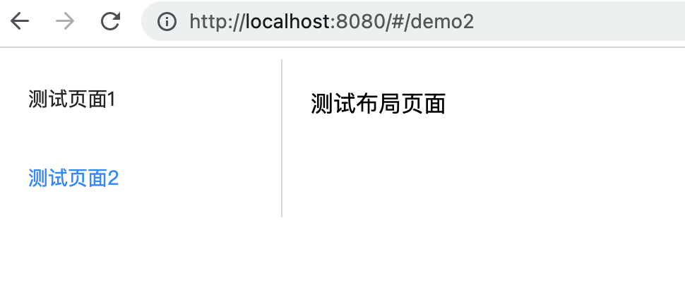
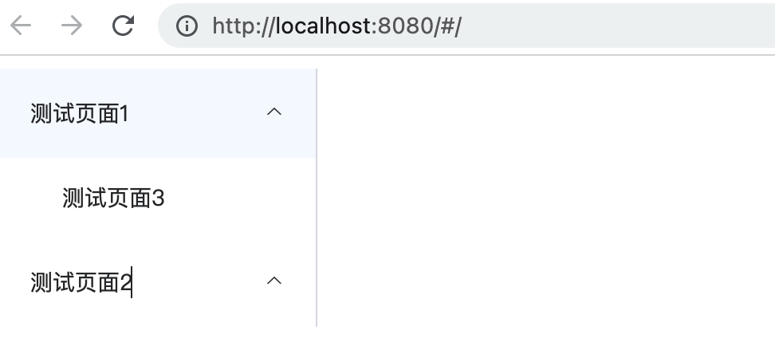

# 权限管理系统vue 路由引入、菜单建设

本章将介绍如何在之前初始化的权限管理系统项目（[搭建教程](权限管理系统VUE项目初始化.md)中进一步搭建路由、菜单相关内容。

## 依赖安装

为了满足路由相关功能，需要引入 vue-router 依赖，安装命令如下。

```shell
yarn add vue-router@4    
```

上述命令执行完成后可以在`package.json`文件中的 dependencies 节点看到如下内容则表示安装成果。

```js
"vue-router" : "4"
```

## 编码

通过前文已经将 vue-router
插件安装成果，本节将进行相关编码，搭建出基础页面，首先编写一个测试用的页面，文件名称叫做MyTest.vue，具体路径是 `src/components/MyTest.vue`
，文件内容如下。

```vue

<template>
  <div>测试布局页面</div>
</template>

<script>
export default {
  name: "MyTest"
}
</script>

<style scoped>

</style>
```

接下来需要根据 vue-router 的编码规则编写相关文件，首先需要创建一个文件用来存储这些路由信息，文件路径 `src/router/index.js`
，基础框架代码如下。

```js
import {createRouter, createWebHashHistory} from 'vue-router'

const routes = []

const router = createRouter({
    history: createWebHashHistory(),
    routes
})

export default router;
```

开发者需要在 routes 变量中填写一些内容，这些内容的模板如下

```js
const routes = [
    {
        path: '',
        component: vue组件,
        name: '',
        children: []
    }
]

```
上述模板内容详情如下。

1. path: 表示请求路径
2. component: 表示vue组件
3. name: 表示名称
4. children: 表示子节点，所需信息和单个节点一样

了解了这些内容后接下来将 MyTest.vue 编写到 routes 中，编写后内容如下

```js
import {createRouter, createWebHashHistory} from 'vue-router'

const routes = [
   {
      path: '/demo1',
      component: () => import ('../components/MyTest.vue'),
      name: '测试页面1',
      children: [
         {
            path: '/demo3',
            component: () => import ('../components/MyTest.vue'),
            name: '测试页面3',
         }
      ]
   },
   {
      path: '/demo2',
      component: () => import ('../components/MyTest.vue'),
      name: '测试页面2',
      children: []
   }

]

const router = createRouter({
   history: createWebHashHistory(),
   routes
})

export default router;


```

编写完成这个内容以后需要将其放入到 vue 实例中，找到 main.js 文件添加如下代码。

```js
import router from './router'
elementApp.use(router)
```

此时编码工作已经完成，但是还没有做页面显示相关的处理，此时启动vue项目并不会看到相关内容，要解决这个问题需要在 App.vue 文件中引入菜单相关组件，具体代码如下。

```vue
<template>
  <div>
    <el-container>
      <el-aside width="200px">
        <el-menu
            class="el-menu-vertical-demo"
            default-active="2"
            router
        >
          <el-menu-item v-for="(it ,index ) in routes" :key="index" index="it.path"
                        route="it.path">
            <span>{{it.name}}</span>
          </el-menu-item>
        </el-menu>
      </el-aside>
      <el-main>
        <router-view></router-view>
      </el-main>
    </el-container>
  </div>

</template>

<script>
export default {

  name: 'App',
  data() {
    return {
      routes: [],

    }
  },
  components: {},
  created() {
    this.routes = this.$router.options.routes;
  }
}
</script>

<style>
</style>

```

在上述代码中处理流程如下。
1. 通过 created 方法将存储在vue实例中的路由信息提取并赋值到数据变量routes中。路由信息即 router/index.js 文件中routes变量信息。
2. 在template标签中引入vue-element-plus中提供的左右布局方式将页面分为左侧和右侧两部分，在左侧承载菜单栏，在右侧承载对应菜单的内容。
   3. 在左侧通过 v-for 指令将存储在 router/index.js 文件中的路由信息进行遍历将相关信息绘制在左侧
   4. 在右侧通过` <router-view></router-view> `将对应菜单的内容进行渲染

此时在浏览器上显示内容如如图所示



在图中可以发现相关显示内容已经显示，但是它只显示了第一层，并没有显示多层数据，下面将对多层数据展示进行改造。需要注意一般多层数据在菜单层面两层即可，过多层级不利于操作定位。修改后vue代码内容如下

```vue
<el-menu
   class="el-menu-vertical-demo"
   default-active="2"
   router
>

 <el-sub-menu v-for="(it , index) in routes" :key="index" :index="it.path">
   <template #title>
     <span>{{ it.name }}</span>
   </template>
   <!-- 二级菜单 -->
   <el-menu-item
       v-for="item2 in it.children"
       :key="item2.id"
       :index="item2.path"
   >{{ item2.name }}
   </el-menu-item>
 </el-sub-menu>
</el-menu>
      
```

注意： 此项修改后一级菜单无法点击进入，仅二级菜单可以点击进入详情页。因为一级菜单无法点击进入因此可以将`router/index.js`文件中的一级菜单的component属性删除，删除后内容如下。
```js
const routes = [
    {
        path: '/demo1',
        name: '测试页面1',
        children: [
            {
                path: '/demo3',
                component: () => import ('../components/MyTest.vue'),
                name: '测试页面3',
            }
        ]
    },
    {
        path: '/demo2',
        name: '测试页面2',
        children: []
    }

]

```
经过修改后此时菜单信息如图所示。




此时进入  http://localhost:8080/ 地址可以发现菜单内容已经正常显示，现在还需要优化第一次进入后的首屏展示内容，首先在el-menu标签中修改 `default-active="2"` 数据，将等号后面的2修改为具体的路由地址，即`router/index.js`文件中的path数据，本例数据为 `            default-active="/demo3"` ，此时访问 http://localhost:8080/ 可以发现右侧主体显示内容中没有显示相关内容，这是因为路由没有跳转，解决这个问题需要在`router/index.js`文件中添加如下代码。

```js
{
     path: "/",
     redirect: {
         name: '测试页面3' // 填写具体跳转的名称，数据值必须在routers变量中
     }
 }
```

经过上述修改后此时再进入 http://localhost:8080/ 即可正常显示左侧菜单的默认选中，以及右侧主体内容的展示。