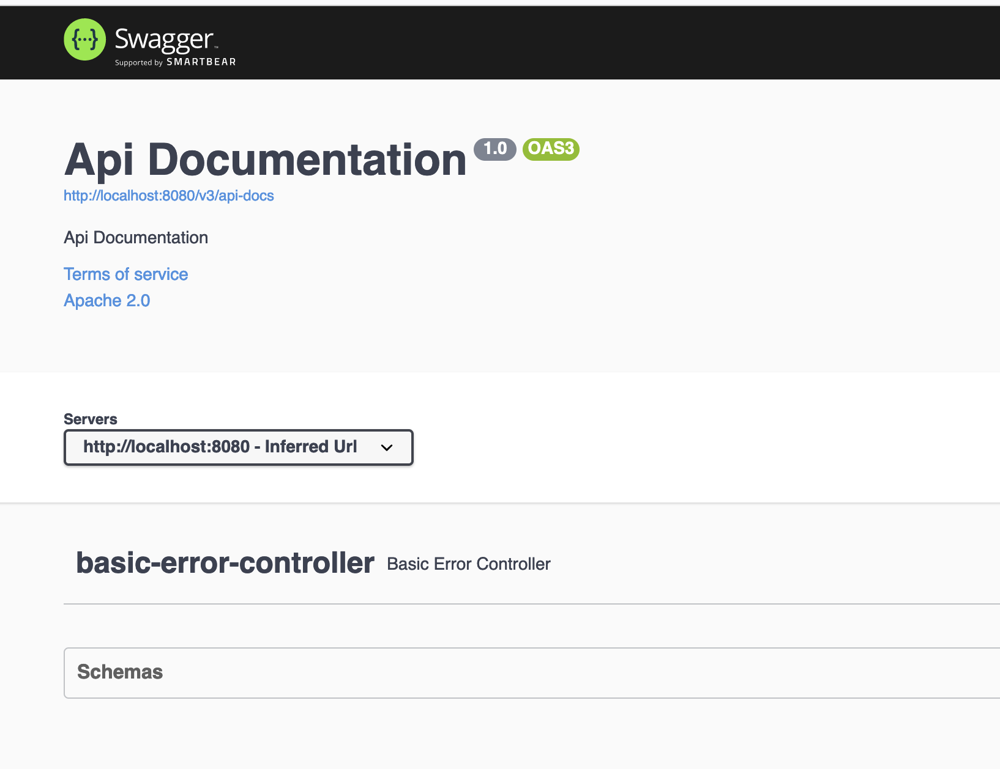

# 项目初始化

本章将介绍RBAC项目的初始化。

## 工程结构

本节将介绍RBAC项目的工程结构，工程结构的确认对后续的研发、维护有一定的帮助。本项目主要包含如下几个核心包。

1. module: 用于存储Java类，注意，这些Java类只有属性和属性设置方法。在module包下含有如下子包
    1. req: 用于存储请求类
    2. res: 用于存储响应类
    3. biz: 用于存储业务类
    4. entity: 用于储存
2. api: 用于存储Controller类，主要作用是向外部提供接口访问。
3. repo: 用于存储与存储介质交互的类。建议: Mapper接口放在该路径下
4. service: 用于存储具体业务类。在service中禁止直接使用Mapper接口，需要使用repo中提供的接口。这样的意义是将类的作用范围做的明确。

## 项目创建
本节将介绍如何搭建一个SpringBoot项目，并且引入相关依赖。首先需要创建一个空的maven项目，然后在pom文件中设置dependencyManagement节点，具体数据信息如下.

```xml
 <dependencyManagement>
     <dependencies>
         <dependency>
             <groupId>org.springframework.boot</groupId>
             <artifactId>spring-boot-dependencies</artifactId>
             <version>2.7.1</version>
             <type>pom</type>
             <scope>import</scope>
         </dependency>

         <dependency>
             <groupId>com.baomidou</groupId>
             <artifactId>mybatis-plus-boot-starter</artifactId>
             <version>3.5.2</version>
         </dependency>
     </dependencies>
 </dependencyManagement>
```

在dependencyManagement节点引入spring-boot-dependencies依赖的目的是统一管理SpringBoot相关依赖的版本，引入mybatis-plus-boot-starter依赖的目的是进行数据库交互。接下来我们编写真正所需要的依赖项。由于本项目需要对外提供接口因此需要使用到SpringBoot项目中的Web模块，此项目还需要与MySQL数据库进行交互因此还需要MySQL驱动，为了提高开发效率还可以引入lombok依赖，为了便于提供api接口文档还可以引入swagger相关依赖，综上所述基础依赖项如下.

```xml
<dependencies>
  <dependency>
      <groupId>org.springframework.boot</groupId>
      <artifactId>spring-boot-starter-web</artifactId>
  </dependency>
   <dependency>
      <groupId>com.baomidou</groupId>
      <artifactId>mybatis-plus-boot-starter</artifactId>
   </dependency>
   <dependency>
      <groupId>mysql</groupId>
      <artifactId>mysql-connector-java</artifactId>
  </dependency>
  <dependency>
      <groupId>org.projectlombok</groupId>
      <artifactId>lombok</artifactId>
  </dependency>
  <dependency>
      <groupId>io.springfox</groupId>
      <artifactId>springfox-boot-starter</artifactId>
      <version>3.0.0</version>
  </dependency>
</dependencies>
```

**注意：如果考虑到未来可能会对引入依赖的版本升级，以及依赖版本的统一管理可以将依赖版本放在pom文件的properties节点下**，以本项目为例放在properties节点下的数据信息如下。

```xml
 <properties>
     <maven.compiler.source>11</maven.compiler.source>
     <maven.compiler.target>11</maven.compiler.target>
     <project.build.sourceEncoding>UTF-8</project.build.sourceEncoding>
     <mybatis-plus-version>3.5.2</mybatis-plus-version>
     <springfox-boot-starter-version>3.0.0</springfox-boot-starter-version>
 </properties>
```

完成上述关于maven的相关配置后下面将进入到项目包创建过程中，首先在src/main/java下创建com.github.kop.rbac包，然后在这个包下创建一个Java类，类名为RbacApplication，该类中的具体代码如下。


```java
@SpringBootApplication(scanBasePackages = {"com.github.kop.rbac"})
@EnableTransactionManagement
public class RbacApplication {
    private static final Logger logger = LoggerFactory.getLogger(RbacApplication.class); 
    
    public static void main(String[] args) {
        SpringApplication.run(RbacApplication.class, args);
        logger.info("rbac项目启动成功");
    }
}

```

在上述代码中使用了两个注解，这两个注解在一个Web项目中属于是必须存在的注解，在@SpringBootApplication注解中设置了scanBasePackages属性，用于指定Spring的bean扫描路径。使用@EnableTransactionManagement注解的目的是开启事务管理，从而达到在出现异常是实现事务自动回滚的功能（需要配合@Transactional注解）。

准备完成上述内容后需要通过代码生成器将数据库实体类、Mapper接口以及Mapper文件进行生成，通过执行CodeGenerator类即可完成生成，生成完成后需要将其反之在各自的包路径下。当生成的类都在各自所在的路径后需要在启动类上添加新的注解@MapperScan，具体添加内容如下。

```java
@MapperScan(basePackages = {"com.github.kop.rbac.repo.mapper"})
```
在上述代码中使用@MapperScan注解指定了mapper的扫描路径，这一点很重要，有时候会因为这个注解没有添加而导致Mapper接口找不到的问题或者Mybatis无法正常使用的问题。至此需要准备的前置工作都已经完成，下面进行SpringBoot的配置文件编辑，具体编辑内容如下。

```yaml

spring:
  application:
    name: rbac-manager
  mvc:
    pathmatch:
      matching-strategy: ANT_PATH_MATCHER
  datasource:
    driver-class-name: com.mysql.jdbc.Driver
    username: root
    password: root123@
    url: 'jdbc:mysql://localhost:3306/rbac?useSSL=false&serverTimezone=UTC&characterEncoding=utf-8'

mybatis-plus:
  configuration:
    log-impl: org.apache.ibatis.logging.stdout.StdOutImpl
  global-config:
    db-config:
      logic-delete-field: deleted
      logic-delete-value: 1
      logic-not-delete-value: 0


```

配置完成后接下来需要启动rbac项目，通过IDEA启动RbacApplication类即可，启动完成后会在控制台看到**rbac项目启动成功**信息。在本项目中引入了swagger依赖，因此可以在浏览器中输出http://localhost:8080/swagger-ui/地址查看具体信息，具体内容如图所示。



至此项目开发环境已经搭建完成，接下来需要做一些便捷性的工作，对响应的统一定义，对异常的统一捕获，关于统一响应类具体代码如下。

```java
@ApiModel(value = "统一返回对象", description = "统一返回对象")
@Data
public class RespVO<T> {
  private int code;
  private String msg;
  private T data;

  public static <T> RespVO<T> error() {
    RespVO<T> tRespVO = new RespVO<>();
    tRespVO.setCode(4001);
    tRespVO.setMsg("处理异常");
    return tRespVO;
  }

  public static <T> RespVO<T> error(AppHttpCodeEnum appHttpCodeEnum) {
    return error(appHttpCodeEnum.getMsg());
  }

  public static <T> RespVO<T> error(String msg) {
    RespVO<T> tRespVO = new RespVO<>();
    tRespVO.setCode(4001);
    tRespVO.setMsg(msg);
    return tRespVO;
  }

  public static <T> RespVO<T> error(Integer code, String msg) {
    RespVO<T> tRespVO = new RespVO<>();
    tRespVO.setCode(code);
    tRespVO.setMsg(msg);
    return tRespVO;
  }

  public static <T> RespVO<T> success() {
    RespVO<T> tRespVO = new RespVO<>();
    tRespVO.setCode(2001);
    tRespVO.setMsg("处理成功");
    return tRespVO;
  }

  public static <T> RespVO<T> success(T data) {
    RespVO<T> tRespVO = new RespVO<>();
    tRespVO.setCode(2001);
    tRespVO.setMsg("处理成功");
    tRespVO.setData(data);
    return tRespVO;
  }
}
```

在这个统一响应对象中还需要使用AppHttpCodeEnum枚举，该枚举定义了本系统的响应编码以及响应文本。

```java
@Getter
public enum AppHttpCodeEnum {
  UPDATE_ERROR(3003, "更新异常");

  int code;
  String msg;

  AppHttpCodeEnum(int code, String msg) {
    this.code = code;
    this.msg = msg;
  }

  public int getCode() {
    return code;
  }

  public String getMsg() {
    return msg;
  }

}
```

接下来还需要制作一个全局异常类，异常类类名为NoceException，具体代码如下。

```java
public class NoceException extends RuntimeException {
  private static final long serialVersionUID = 1L;

  private AppHttpCodeEnum enums;
  private String msg;
  private int code = 3500;

  public NoceException(String msg) {
    super(msg);
    this.msg = msg;
  }

  public NoceException(String msg, Throwable e) {
    super(msg, e);
    this.msg = msg;
  }

  public NoceException(String msg, int code) {
    super(msg);
    this.msg = msg;
    this.code = code;
  }

  public NoceException(String msg, int code, Throwable e) {
    super(msg, e);
    this.msg = msg;
    this.code = code;
  }

  public NoceException(AppHttpCodeEnum enums, String message) {
    super(message);
    this.enums = enums;
    this.code = enums.getCode();
  }

  public NoceException(AppHttpCodeEnum enums) {

    this.enums = enums;
  }

  public AppHttpCodeEnum getEnums() {
    return enums;
  }

  public void setEnums(AppHttpCodeEnum enums) {
    this.enums = enums;
  }

  public String getMsg() {
    return msg;
  }

  public void setMsg(String msg) {
    this.msg = msg;
  }

  public int getCode() {
    return code;
  }

  public void setCode(int code) {
    this.code = code;
  }
}
```

有了这些类以后即可编写SpringBoot中的全局异常捕获器，这里将类名定义为ExceptionCatch，具体代码如下。

```java
@RestControllerAdvice
@Slf4j
@RestController
public class ExceptionCatch {

    public static final String ERROR_MSG = "error_msg";


    @ExceptionHandler(Exception.class)
    public RespVO<String> exception(Exception e) {
        log.error(e.getMessage());
        e.printStackTrace();
        return RespVO.error(e.getMessage());
    }

    @ExceptionHandler(NoceException.class)
    public RespVO<String> leadExceptionHandler(NoceException nsException) {
        nsException.printStackTrace();
        return RespVO.error(nsException.getCode(), nsException.getMessage());
    }
}
```


## 日志

在一个项目中日志是一个十分重要的环境，它可以在项目出现异常的时候提供巡查方向。在本项目中使用logback作为日志框架，首先需要在`src/main/resources`路径下创建名为logback-spring.xml的文件，文件内容如下。

```xml
<?xml version="1.0" encoding="UTF-8"?>
<configuration debug="true">
   <springProperty name="LOG_PATH" source="log.logPath" defaultValue="./"/>
   <springProperty name="PROJECT_NAME" source="spring.application.name" defaultValue="rbac-manager"/>

   <!-- 控制台输出 -->
   <appender name="CONSOLE" class="ch.qos.logback.core.ConsoleAppender">
      <withJansi>true</withJansi>
      <encoder class="ch.qos.logback.classic.encoder.PatternLayoutEncoder">
         <pattern>[%d{yyyy-MM-dd HH:mm:ss.SSS}] [%thread] %highlight([%-5level] %logger{50} - %msg%n)</pattern>
         <charset>UTF-8</charset>
      </encoder>
   </appender>


   <!-- 系统error日志文件 -->
   <appender name="SYSTEM-ERROR"  class="ch.qos.logback.core.rolling.RollingFileAppender">
      <!-- 过滤器，只打印ERROR级别的日志 -->
      <filter class="ch.qos.logback.classic.filter.LevelFilter">
         <level>ERROR</level>
         <onMatch>ACCEPT</onMatch>
         <onMismatch>DENY</onMismatch>
      </filter>
      <rollingPolicy class="ch.qos.logback.core.rolling.SizeAndTimeBasedRollingPolicy">
         <!--日志文件输出的文件名-->
         <FileNamePattern>${LOG_PATH}/${PROJECT_NAME}.system_error.%d{yyyy-MM-dd}.%i.log</FileNamePattern>
         <!--日志文件保留天数-->
         <MaxHistory>30</MaxHistory>
         <!--日志文件最大的大小-->
         <MaxFileSize>500MB</MaxFileSize>
      </rollingPolicy>

      <encoder class="ch.qos.logback.classic.encoder.PatternLayoutEncoder">
         <!--格式化输出：%d表示日期，%thread表示线程名，%-5level：级别从左显示5个字符宽度%msg：日志消息，%n是换行符-->
         <pattern>[%d{yyyy-MM-dd HH:mm:ss.SSS}] [%thread] [%-5level] %logger{50} - %msg%n</pattern>
         <charset>UTF-8</charset>
      </encoder>
   </appender>

   <!-- 系统info日志文件 -->
   <appender name="SYSTEM-INFO"  class="ch.qos.logback.core.rolling.RollingFileAppender">
      <rollingPolicy class="ch.qos.logback.core.rolling.SizeAndTimeBasedRollingPolicy">
         <FileNamePattern>${LOG_PATH}/${PROJECT_NAME}.system_info.%d{yyyy-MM-dd}.%i.log</FileNamePattern>
         <MaxHistory>5</MaxHistory>
         <MaxFileSize>500MB</MaxFileSize>
      </rollingPolicy>
      <encoder class="ch.qos.logback.classic.encoder.PatternLayoutEncoder">
         <pattern>[%d{yyyy-MM-dd HH:mm:ss.SSS}] [%thread] [%-5level] %logger{50} - %msg%n</pattern>
         <charset>UTF-8</charset>
      </encoder>
   </appender>


   <logger name="com.github.kop.rbac.repo.mapper" level="INFO"/>

   <root level="INFO">
      <appender-ref ref="CONSOLE" />
      <appender-ref ref="SYSTEM-INFO" />
   </root>

</configuration>
```

此时在启动项目便会在根目录下找到名为rbac-manager.system_error.2022-07-26.0.log的文件，注意这个文件名称的时间部分内容会随着当前时间而改变。如果需要修改日志文件输出路径可以修改logback-spring.xml文件中的如下属性

```
<springProperty name="LOG_PATH" source="log.logPath" defaultValue="日志文件输出路径"/>
```

除此之外还可以通过SpringBoot配置文件进行修改，添加log.logPath属性即可。

## 构建

本节将介绍如何将前文所搭建的Java项目（SpringBoot项目）进行构建。首先需要在pom文件中添加build标签，然后在build标签下添加resources节点，该节点表示哪些资源是需要引入的，如果没有该节点在项目中出现的一些资源文件会无法打包到构建结果中，具体resource数据信息如下

```xml
<resources>
    <resource>
        <directory>src/main/java</directory>
        <filtering>false</filtering>
    </resource>
    <resource>
        <directory>src/main/resources</directory>
        <includes>
            <include>**/*.yml</include>
            <include>**/*.yaml</include>
            <include>**/*.properties</include>
            <include>**/*.xml</include>
        </includes>
        <filtering>false</filtering>
    </resource>
</resources>
```

接下来需要引入SpringBoot项目构建所需要的插件：spring-boot-maven-plugin，有关该插件的配置信息如下。

```xml
<plugin>
    <groupId>org.springframework.boot</groupId>
    <artifactId>spring-boot-maven-plugin</artifactId>
    <version>2.7.1</version>
    <executions>
        <execution>
            <goals>
                <goal>repackage</goal>
            </goals>
        </execution>
    </executions>


    <configuration>
        <includeSystemScope>true</includeSystemScope>
        <mainClass>com.github.kop.rbac.RbacApplication</mainClass>
    </configuration>
</plugin>
```

在上述代码中需要将mainClass标签的数据信息修改为具体的启动类，注意需要填写**类全路径**。

接下来需要引入Maven构建插件，通过这个插件可以配置编码、编译版本，有关该插件的配置信息如下。

```xml
<plugin>
    <groupId>org.apache.maven.plugins</groupId>
    <artifactId>maven-compiler-plugin</artifactId>
    <version>3.6.0</version>
    <configuration>
        <source>11</source>
        <target>11</target>
        <encoding>UTF-8</encoding>
    </configuration>
</plugin>
```

最后需要引入Maven中的jar插件，有关该插件的配置信息如下。

```xml
<plugin>
    <groupId>org.apache.maven.plugins</groupId>
    <artifactId>maven-jar-plugin</artifactId>
    <version>3.1.0</version>
    <configuration>
        <archive>
            <manifest>
                <mainClass>com.github.kop.rbac.RbacApplication</mainClass>
            </manifest>
        </archive>
    </configuration>
</plugin>
```

上述插件都在pom文件中准备完成后在项目根目录下执行`mvn clean install`即可将项目进行打包，打包后的文件会位于target目录下，在该目录中会出现rbac-manager-1.0-SNAPSHOT.jar文件，通过java -jar rbac-manager-1.0-SNAPSHOT.jar的方式即可将项目启动。

注意：**rbac-manager-1.0-SNAPSHOT.jar的文件命名规则是artifactId+version，如果修改了其中任意一项都会导致文件名变化，如果需要让文件名稳定可以在build标签下增加finalName标签，并在finalName标签中填写所需文件名**，本例如下。

```
<finalName>rbac-manager</finalName>
```

通过上述方式修改后生成的文件名是一个稳定的文件名，可以通过java -jar rbac-manager将项目启动。

### Docker 构建

前文介绍了如何通过Maven打包一个SpringBoot项目并且使用java命令将项目启动，本节将介绍如何将项目使用Docker进行构建，首先需要在项目根目录下创建一个名为DockerFile的文件，在文件中输入如下内容.

```dockerfile
FROM adoptopenjdk/openjdk11:alpine-jre
ARG JAR_FILE=target/rbac-manager.jar
WORKDIR /opt/app
COPY ${JAR_FILE} app.jar
ENTRYPOINT ["java","-jar","app.jar"]
```

在上述代码中需要注意JAR_FILE数据的填写，如果有必要可以填写为全路径。在完成DockerFile文件的编写后进入文件所在目录然后执行如下命令

```
docker build -t rbac-manager:v0.0.1 . -f DockerFile 
```

在上述命令执行后会在控制台输出类似如下内容

```
[+] Building 4.0s (8/8) FINISHED                                                                                                                                                                                                        
 => [internal] load build definition from DockerFile                                                                                                                                                                               0.0s
 => => transferring dockerfile: 37B                                                                                                                                                                                                0.0s
 => [internal] load .dockerignore                                                                                                                                                                                                  0.0s
 => => transferring context: 2B                                                                                                                                                                                                    0.0s
 => [internal] load metadata for docker.io/adoptopenjdk/openjdk11:alpine-jre                                                                                                                                                       3.8s
 => [1/3] FROM docker.io/adoptopenjdk/openjdk11:alpine-jre@sha256:1e586c44576d8b923dca18b6e920bc05605dd0c0672c731eed836b47ed9515af                                                                                                 0.0s
 => [internal] load build context       
```

等全部执行完成后可以通过`docker images | grep rbac  `查看相关镜像信息，本例相关信息如下

```
REPOSITORY                                                                   TAG                                                     IMAGE ID       CREATED         SIZE
rbac-manager                                                                 v0.0.1                                                  f063d77389ca   5 minutes ago   186MB

```

确认镜像的唯一标识后可以通过`docker run -d -p 8080:8080 -t f063d77389ca`命令将镜像进行启动，注意**如果在SpringBoot的配置文件中设置了server.port属性在docker命令中需要将-p参数中的第二个参数修改为server.port中的数据。**，启动完成后可以访问http://localhost:8080/swagger-ui/查看swagger文档。如果需要确认是否正常启动还可以通过` docker ps | grep 镜像唯一标识` 的方式进行判断，执行后信息如下。

```

CONTAINER ID   IMAGE                    COMMAND                  CREATED          STATUS          PORTS                    NAMES
d598d22d1fcd   f063d77389ca             "java -jar app.jar"      8 minutes ago    Up 8 minutes    0.0.0.0:8080->8080/tcp   strange_germain

```

如果需要将镜像的运行环境停止，可以使用 `docker stop CONTAINER_ID`，在本例中执行`docker stop d598d22d1fcd`即可停止。注意，由于使用本项目使用alpine进行容器创建因此进入容器需要使用`docker exec -it 容器名称 /bin/sh   `命令。